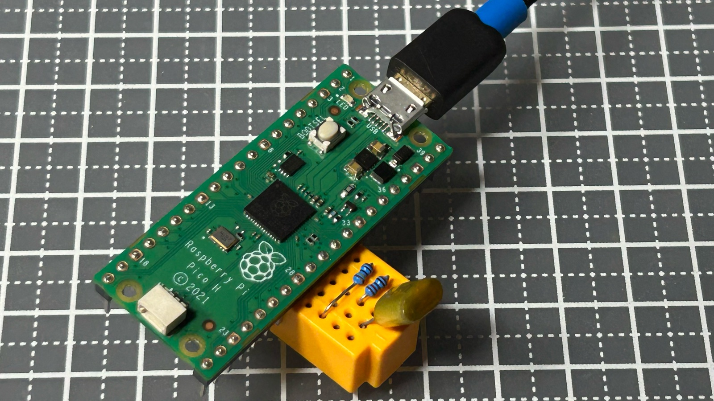
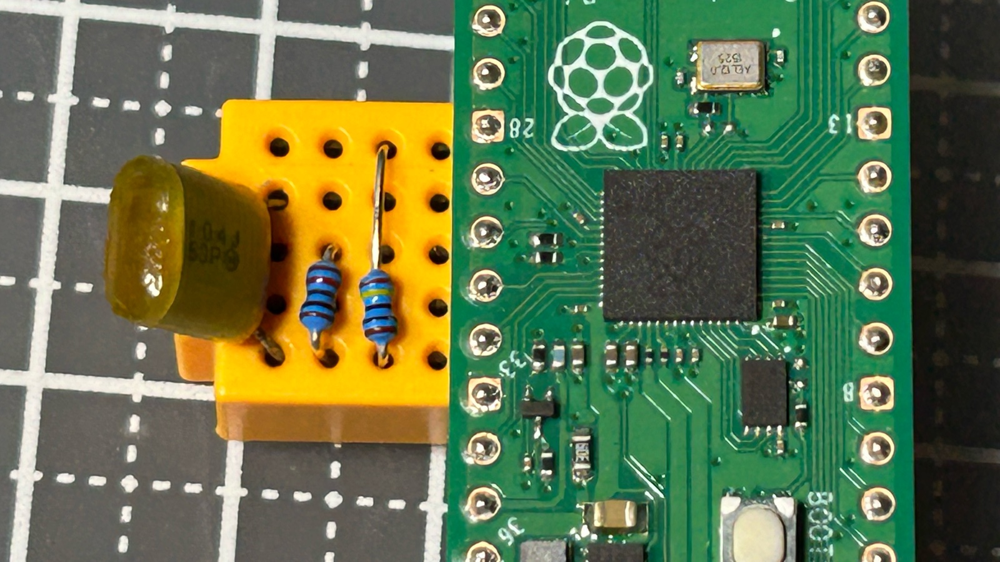
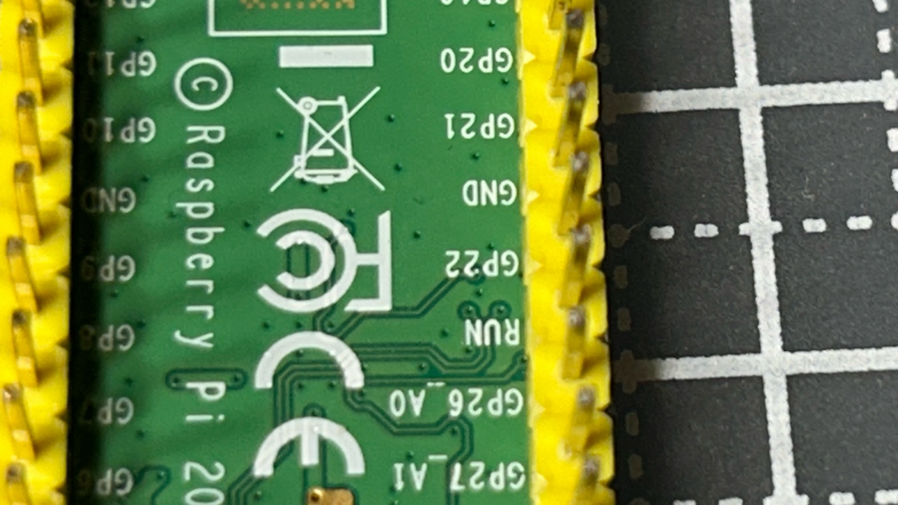
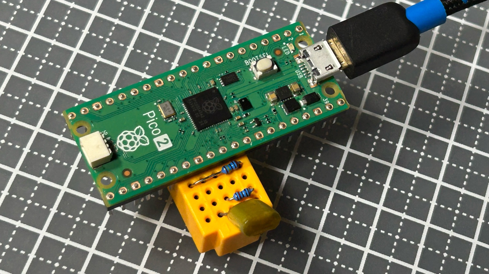

# pico-cap-meter

Raspberry Pi Pico と抵抗 2 本で作るコンデンサ容量計です。数 pF から数百 µF まで、自動でレンジを切り替えて測ります。測定値と「今やっていること」「次にやること」を表示するアプリは、ブラウザ版 (Windows / Mac / Linux) と Mac アプリの 2 種類があります。



## ダウンロード

[Releases](https://github.com/Satachito/pico-cap-meter/releases/latest) から、使うボード用のファームウェアをダウンロードしてください。アプリは、インストール不要のブラウザ版か、Mac アプリのどちらかを使います。

**ブラウザ版: https://satachito.github.io/pico-cap-meter/**
(Windows / Mac / Linux の Chrome か Edge で開きます。Safari と Firefox は Web Serial に対応していないので使えません)

| ファイル | 内容 |
| --- | --- |
| `cap_meter-pico.uf2` | 初代 Pico (RP2040) 用のファームウェア |
| `cap_meter-pico2.uf2` | Pico 2 (RP2350) 用のファームウェア |
| `CapMeter-mac.zip` | Mac アプリ (macOS 14 以降、Apple シリコン / Intel) |

1. BOOTSEL ボタンを押しながら Pico を USB でつなぎ、出てきたドライブ (Pico は `RPI-RP2`、Pico 2 は `RP2350`) に UF2 をドラッグします。
2. アプリを開きます。
    - ブラウザ版: 上の URL を Chrome か Edge で開き、「Pico に接続」を押して Pico を選びます。次からは自動でつながります。
    - Mac アプリ: `CapMeter-mac.zip` を展開して `CapMeter.app` を開きます。Apple の公証を受けていないので、初回は開けないという警告が出ます。システム設定の「プライバシーとセキュリティ」で「このまま開く」を選んでください。
    - 2 つのアプリで同時に同じ Pico を開かないでください (データが分かれてしまいます)。
3. アプリの「次にやること」に従って、ゼロ点 → しきい値 → レンジ間の順に校正します。

## 動作確認

| 組み合わせ | 状況 |
| --- | --- |
| ブラウザ版 + Mac の Chrome | 確認済み |
| ブラウザ版 + Windows の Chrome | 確認済み |
| Mac アプリ (Apple シリコン) | 確認済み |
| ファームウェア + 初代 Pico (RP2040) | 確認済み |
| ファームウェア + Pico 2 (RP2350 A2) | 確認済み (低容量レンジが約 0.4% 小さく出ます。下の「Pico 2 について」) |
| Edge、Linux、Intel の Mac、Pico 2 (RP2350 A4) | 未確認 |

## 回路

```
GP22 ──[10kΩ]──┐
               ├── GP26 (ADC0) ── 測るコンデンサ(+) ──(−)── GND
GP21 ──[1MΩ ]──┘
```

- Pico をブレッドボードに直接挿し、ピン 27〜31 (GP21 / GND / GP22 / RUN / GP26) の行を使います。部品は 3 × 5 の穴に収まります。配置は [BreadBoard.txt](BreadBoard.txt) にあります。
- RUN の行には何も挿さないでください (GND に落ちると Pico がリセットされます)。
- 電解コンデンサは + を GP26 側に挿し、挿す前に足をショートして放電してください。
- 1MΩ の足は Pico の基板に触れないようにしてください。わずかでも触れると、低容量レンジの値が大きくずれて揺れます (高容量レンジは正常なまま)。
- 抵抗値は初期値の公称値 (1MΩ / 10kΩ) のままでも測れますが、次のどちらかで精度が上がります (Mac アプリの「抵抗値」欄からできます)。
    - テスターで測った値を入れる (`R` コマンド)
    - 値の分かっているコンデンサ (C0G / PP フィルム / ポリスチレンの ±1% など) を挿して、抵抗値を逆算させる (`K` コマンド)。30nF 以上のものなら 10kΩ 側とレンジ間校正もまとめて済みます

| 真上から (部品は 3 × 5 の穴に収まる) | 裏側 (使う 5 本のピン) |
| --- | --- |
|  |  |

## 測り方

| レンジ | 抵抗 | 方法 | 範囲の目安 |
| --- | --- | --- | --- |
| 低容量 | 1MΩ (GP21) | GP26 のデジタル入力が HIGH になるまでを PIO で数える (1 カウント 16ns) | 約 280nF まで |
| 高容量 | 10kΩ (GP22) | 充電しながら ADC で 10〜80% を読み、充電カーブを最小二乗で当てはめる | 約 100nF〜1000µF |

- 自動レンジは前回のレンジから測り始め、低容量レンジが 0.2 秒でタイムアウトしたら高容量レンジに、高容量レンジで 200nF 未満なら低容量レンジに移ります。
- 低容量レンジでは ADC を読まないので、オペアンプのバッファは不要です (ADC は読むたびに入力から電荷を出し入れするため、1MΩ 越しに読むと値がずれます)。
- 高容量レンジは多数の点で当てはめるので、RP2040 の ADC の DNL 段差 (エラッタ RP2040-E11) の影響が平均化されます。

## ビルドと書き込み

Pico SDK 2.x と、newlib 入りの Arm GNU Toolchain が必要です (Homebrew の `arm-none-eabi-gcc` 単体では足りません)。

```sh
export PICO_SDK_PATH=~/pico/pico-sdk
export PICO_TOOLCHAIN_PATH=~/pico/toolchain/arm-gnu-toolchain-15.3.rel1-darwin-arm64-arm-none-eabi

# 初代 Pico
cmake -S . -B build -DPICO_BOARD=pico && cmake --build build -j8
# Pico 2
cmake -S . -B build-pico2 -DPICO_BOARD=pico2 && cmake --build build-pico2 -j8
```

BOOTSEL を押しながら USB をつなぎ、`build/cap_meter.uf2` (Pico 2 は `build-pico2/cap_meter.uf2`) をコピーします。一度書き込めば、2 回目からは `picotool load -f -x build/cap_meter.uf2` で BOOTSEL なしに書き込めます。

## 使い方 (USB シリアル)

0.3 秒ごとに測定値を出します。1 文字送るとコマンドになり、放電中や測定中でもすぐに処理します。

| コマンド | 内容 |
| --- | --- |
| `a` / `l` / `h` | 自動レンジ / 低容量レンジ固定 / 高容量レンジ固定 |
| `z` | ゼロ点校正 (何も挿さずに実行。浮遊容量を測る) |
| `c` | しきい値校正 (1nF〜1µF のコンデンサを挿して実行) |
| `x` | レンジ間校正 (30〜250nF のフィルムコンデンサを挿して実行) |
| `i` | 校正値の表示 |
| `R <1MΩ側> <10kΩ側>` | 抵抗の実測値を Ω で設定 (例 `R 998000 9870`)。レンジ間校正はやり直しになります |
| `K <nF>` | 基準コンデンサ校正 (例 `K 100`)。挿した基準コンデンサの値から抵抗値を逆算します。先に `z` と `c` が必要です |

校正値と抵抗値はフラッシュの最後のセクタに保存され、電源を切っても、ファームウェアを書き込み直しても残ります (保存形式が変わったときは初期化されます)。最初に `z` → `c` → `x` の順に一度ずつ実行してください。テスターの値を入れるなら最初に、基準コンデンサで校正するなら `c` のあとに行います。

`#` で始まる行は Mac アプリ向けの機械可読な出力です (`#state` / `#v` / `#meas` / `#mode` / `#cal` / `#done`。詳細は [main.cpp](main.cpp) の先頭のコメント)。

## ブラウザ版

[web/](web/) にあります (HTML / CSS / JavaScript だけで、ビルド不要)。main に push すると GitHub Actions で GitHub Pages に公開されます。手元で試すときは:

```sh
python3 -m http.server 8765 --directory web
```

で http://localhost:8765 を Chrome で開きます。`#demo` を付けて開くと (http://localhost:8765/#demo)、Pico をつながずに画面だけを動かせます。

## Mac アプリ

```sh
mac/build_app.sh
open mac/CapMeter.app
```

macOS 14 以降。Pico を USB でつなぐと自動で認識し、測定値、今やっていること (測定中・放電中と電圧など)、次にやること (校正の案内) を表示します。抵抗値の入力と校正もアプリからできます。

## 精度と注意点

- 同じコンデンサを繰り返し測ったばらつきは、低容量レンジで約 ±0.01% です。絶対精度は抵抗を測ったテスターの精度で決まり、約 ±1% です。
- 高容量レンジ (10kΩ) はブレッドボードの接触抵抗に敏感です。接触抵抗 100Ω で約 1% 大きく出ます。足の短いコンデンサや、浅く刺さった足に注意してください。
- 低容量レンジ (1MΩ) は、ノードのまわりの数 MΩ のリーク (指で触れるなど) で大きく出ます。

## Pico 2 (RP2350) について

Pico 2 でも動きますが、RP2350 A2 のエラッタ E9 (入力バッファを有効にした Hi-Z のピンが 2V 台に張り付こうとする) の影響があります。

- 抵抗側のピン (GP21 / GP22) は、Hi-Z にするときに入力バッファを切って対策しています。
- 測定するピン (GP26) は PIO で入力を見るので切れません。外付けのプルダウン抵抗も、1MΩ との分圧で測れなくなるので使えません。この影響で、RP2350 A2 では低容量レンジが約 0.4% 小さく出ます。
- E9 が修正されたとされる RP2350 A4 は試していません。



## ライセンス

[MIT](LICENSE)
